## LLM (Large Language Model) Agents'(Ajanları)

### Agent(Ajan) Nedir?
Karmaşık görevleri yerine getirmek için çeşitli araçlar kullanarak uzun süreler boyunca bağımsız olarak çalışan tamamen otonom sistemler olarak tanımlanır.

### LLM Ajanı Nedir?
LLM'lerin kendi süreçlerini ve araç kullanımlarını dinamik olarak yönlendirdikleri ve görevlerin nasıl gerçekleştirileceği üzerinde kontrolü sürdürdükleri sistemlerdir.


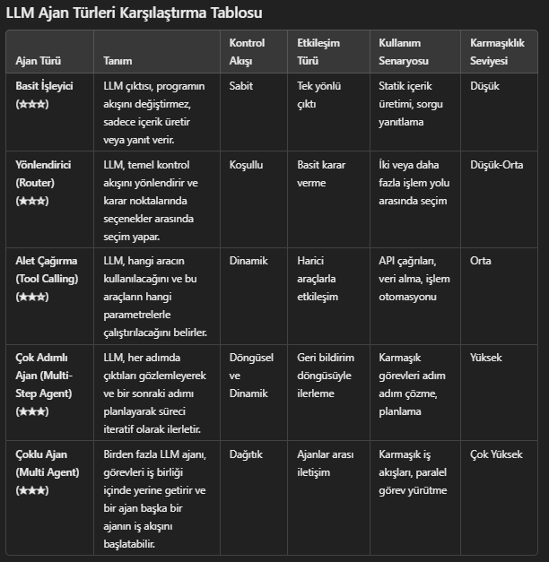
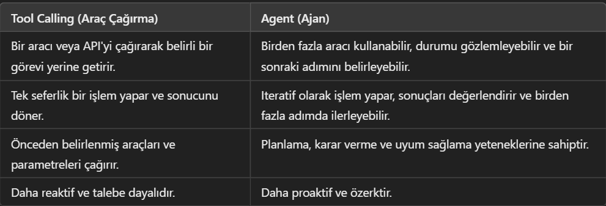

## LLM Agent Oluşturma

#### 1.) Hedef ve Rol Belirleme
* **Hedef**: Ajanın amacı nedir? (Örn: müşteri sorularını yanıtlamak, finansal veri analizi yapmak vb.)

* **Rol**: Ajanın kimliği ve sorumlulukları nelerdir? (Örn: "Bir finans danışmanı olarak hareket et.")
* **Görevler**: Ajanın yerine getirmesi gereken spesifik görevleri belirle.

- Örnek:
"Bir müşteri destek ajanı, kullanıcılardan gelen teknik soruları yanıtlayacak ve gerektiğinde ilgili belgeleri sağlayacak."

#### 2.) Araçların (Tools) Entegrasyonu
* **API Entegrasyonları**: Dış hizmetlere erişim (ör. hava durumu API'si, veri tabanları).

* **Kod Yürütme Araçları**: Python kodu çalıştırabilen araçlar.

*  **Arama Motorları**: Gerçek zamanlı veri çekmek için (ör. Bing, Google API).

* **Özel Araçlar**: İş mantığına özel araçlar (ör. CRM 
araçları).

-  Örnek:
"Ajan, hava durumu API'sine bağlanarak kullanıcıya günlük hava durumu raporu sunabilir."

#### 3.) Bellek (Memory) Sistemi Ekleme
* **Kısa Süreli Bellek (Short-Term Memory)**: Sohbet sırasında geçici olarak verileri hatırlama.
* **Uzun Süreli Bellek (Long-Term Memory)**: Daha önceki oturumlardan gelen bilgileri hatırlama ve kullanma.
* **Dış Depolama**: Bilgileri veri tabanlarına kaydetme ve geri alma.

- Örnek:
"Ajan, bir kullanıcının önceki siparişlerini hatırlayarak kişiselleştirilmiş önerilerde bulunur."

#### 4.) 4. Planlama ve Akış Tasarımı
* **Durum Yönetimi**: Ajan, her adımda çıktıları değerlendirerek bir sonraki adımı planlamalı.
* **Kontrol Döngüsü**: Planla → Eylem Yap → Gözlemle → Tekrar Planla döngüsü uygulanır.
* **Karar Noktaları** : İki veya daha fazla seçenek arasında mantıksal kararlar alınır.

- Örnek:
"Eğer kullanıcının sorusu teknik bir konuysa teknik desteğe yönlendir, değilse genel bilgi ver."

#### 5.) Çoklu Ajan Yapıları (Opsiyonel)
* **Ajanlar Arası İş Bölümü**: Farklı ajanlar farklı görevlerden sorumlu olabilir (ör. bir ajan veri toplar, diğeri analiz eder).
* **İletişim ve Koordinasyon**: Ajanlar birbirleriyle veri paylaşarak iş birliği yapar.

- Örnek:
"Bir ajan kullanıcıdan veri alır, diğer ajan bu veriyi analiz eder ve sonucu ilk ajana iletir."

#### 6.) Teknoloji Seçimi ve Framework Kullanımı
```
from langchain import OpenAI, Agent, Tool

# Araç tanımı
def weather_info(location):
    return f"{location} için hava durumu 25°C, güneşli."

tools = [
    Tool(
        name="Weather Tool",
        func=weather_info,
        description="Belirli bir lokasyonun hava durumunu getirir."
    )
]

# Ajan oluşturma
agent = Agent(
    llm=OpenAI(model="gpt-4"),
    tools=tools,
    verbose=True
)

# Ajanı çalıştır
response = agent.run("İstanbul'un hava durumu nasıl?")
print(response)

```
##### Yazılım Ajanı, LLM Kullanan Yazılım Ajanı ve LLM Ajanı Arasındaki Farklar:
* Bu üç terim arasındaki farklar, ajanın nasıl çalıştığı, hangi teknolojileri kullandığı ve ne kadar özerk veya esnek olduğu ile ilgilidir.

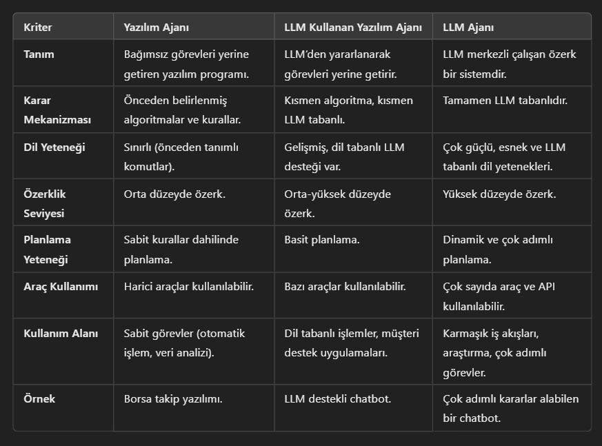

* **Yazılım Ajanı**: Geleneksel algoritmalarla çalışan, özerk yazılımlar.

* **LLM Kullanan Yazılım Ajanı** : Geleneksel ajanlara LLM desteği eklenmiş hibrit yapılar.
* **LLM Ajanı**: Tamamen LLM tabanlı çalışan, araç çağırma ve iteratif planlama yapabilen modern özerk sistemler.

🔑 Anahtar Fark:

* **LLM Kullanan Yazılım Ajanı**, LLM'yi yalnızca bir araç olarak kullanır.
* **LLM Ajanı**, tamamen LLM tabanlı bir sistem olarak inşa edilir ve tüm süreci yönetir.

#### Popüler LLM Frameworkler
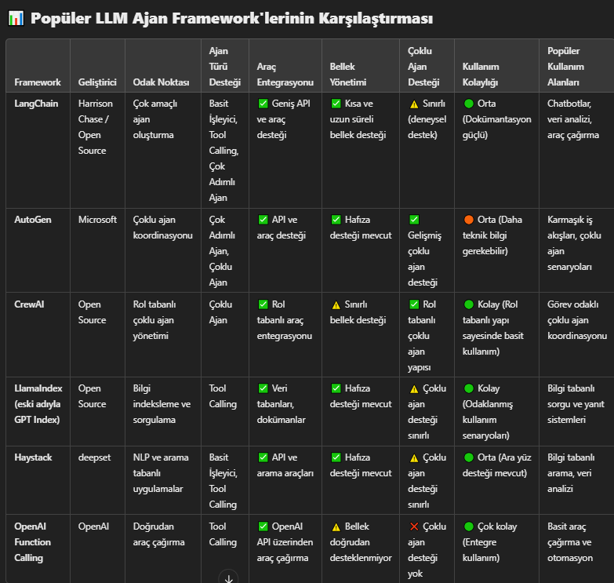

#### LLM Agent Tipleri


#### Agent ve Reasoning Farkı
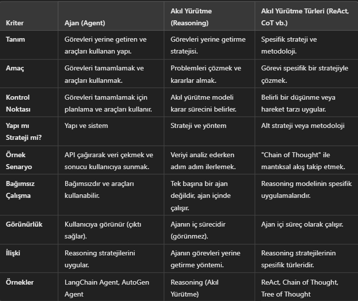

#### Reasoning Modelleri
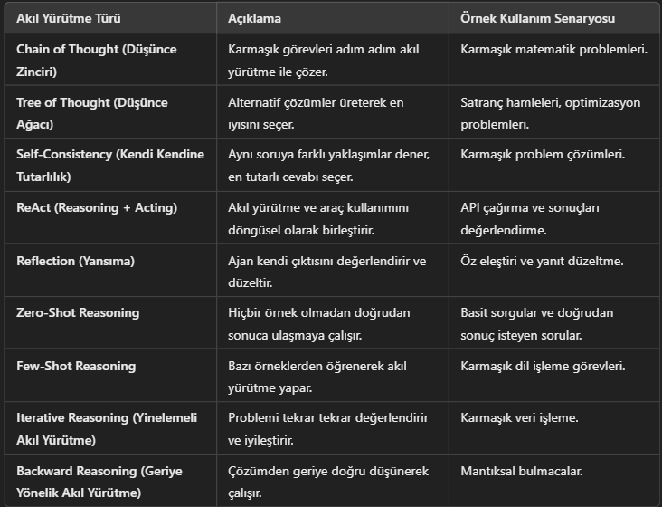

* **Ajan (Agent)** bir yapı veya sistemdir. Görevleri tamamlamak için araçları ve akıl yürütme modellerini kullanır.
* **Akıl Yürütme (Reasoning)** ise ajanın bir stratejisi veya yöntemi olarak tanımlanır. Ajanın düşünme ve problem çözme sürecini belirler.

1.) **Ajan (Agent)**: Görevi başlatır ve araçları kullanır.
2.) **Reasoning (Akıl Yürütme)**: Görevin nasıl çözüleceğine karar verir.
3.) **Akıl Yürütme Modeli (ReAct, CoT vb.)**: Spesifik bir strateji kullanarak adım adım ilerler.

#### Reasoning Tipleri
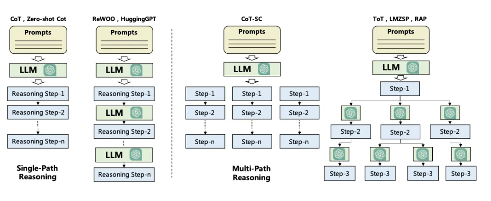

#### Basit bir  agent
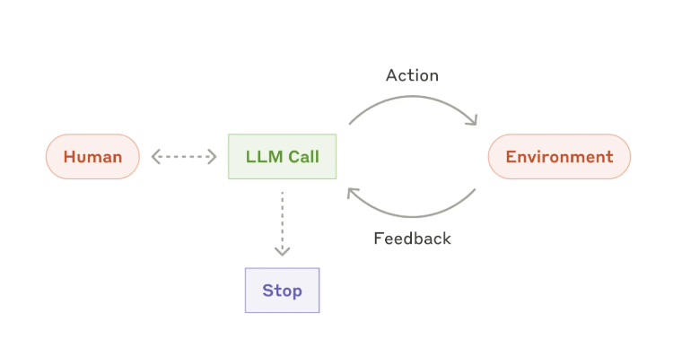

#### AI Agent vs. LLM Agent
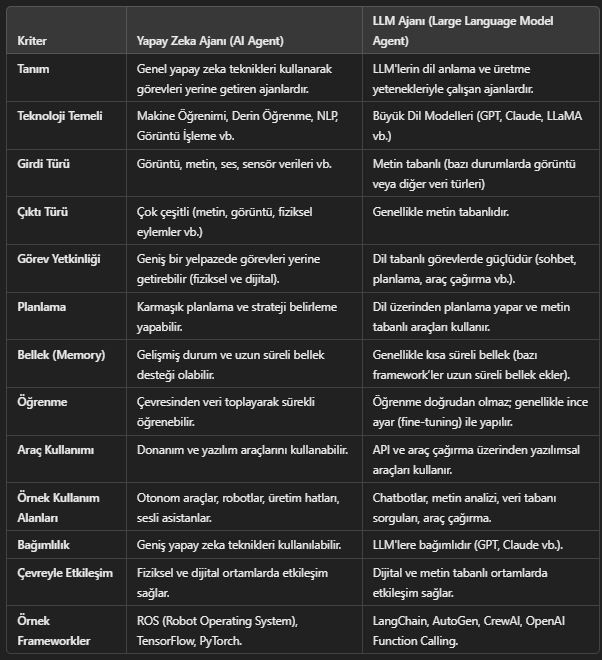
* **Yapay Zeka Ajanı**: Otonom araçlar, robotik sistemler, görüntü işleme görevleri.
* **LLM Ajanı**: Chatbotlar, veri tabanı sorguları, dil tabanlı analiz ve araç çağırma görevleri.

#### LLM Agent ve İş Akışı
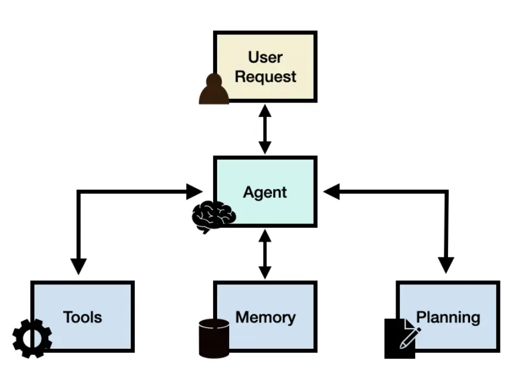

#### Multi-Agent Sistemleri
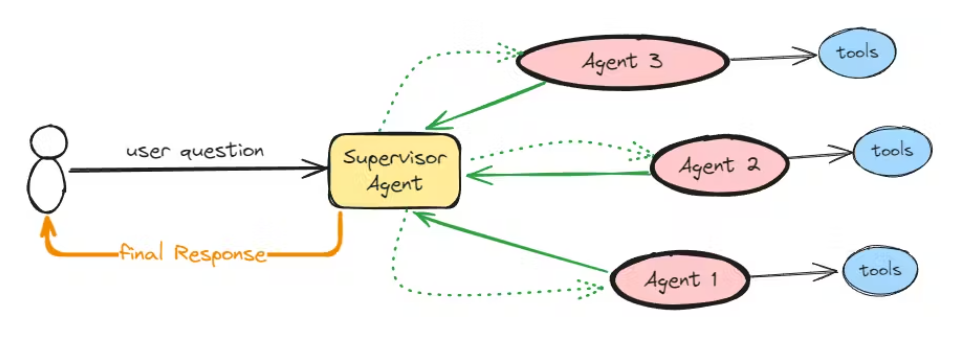
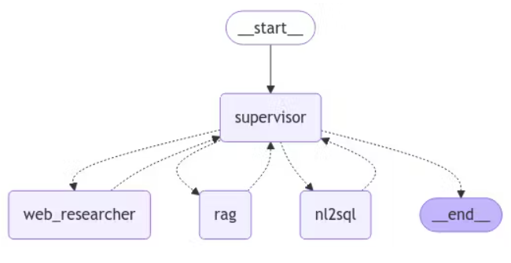

Genel olarak, bir LLM ajan çerçevesi aşağıdaki temel bileşenlerden oluşabilir:
* **Kullanıcı Talebi** - bir kullanıcı sorusu veya talebi
* **Ajan/Beyin** - koordine edici olarak hareket eden ajan çekirdeği
* **Planlama** - ajana gelecekteki eylemleri planlamasında yardımcı olur
* **Hafıza** - ajanın geçmiş davranışlarını yönetir
#### Agent Mimarisi ve Bileşenleri
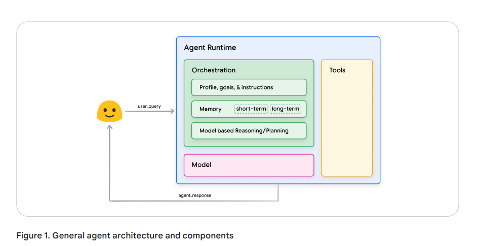


#### Agent Workflow Geleceği


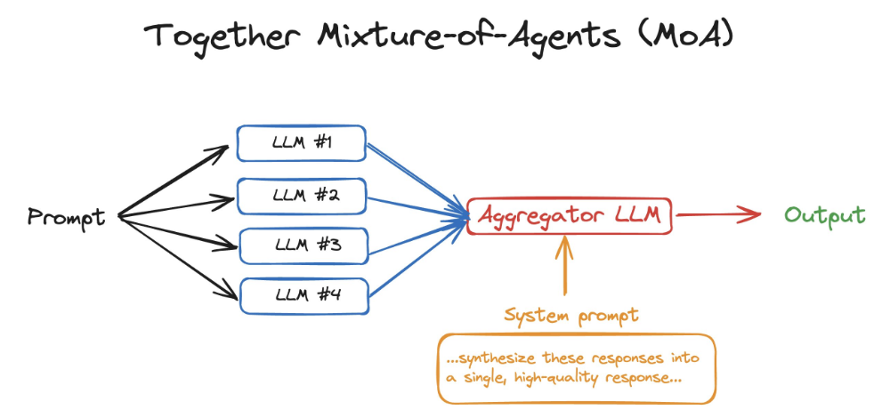

#### Bir yapay zeka destekli iş akışı mimarisi
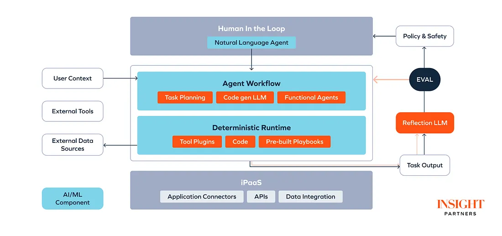

Kullanıcıdan gelen bağlam (User Context), harici araçlar ve harici veri kaynakları, “Agent Workflow” (Görev Planlama, Kod Üretimi, Fonksiyonel Ajanlar) üzerinden işleniyor. Deterministik Çalışma Zamanı katmanı, araç eklentileri, kod ve önceden hazırlanmış görev dizileri ile bu süreçleri destekliyor. iPaaS bileşeni, uygulama bağlayıcıları, API’ler ve veri entegrasyonu ile altyapıyı sağlıyor. Ayrıca, bir “Reflection LLM” (Refleksif LLM) ve “EVAL” sistemi, çıktıların değerlendirilmesi ve güvenlik/politika kurallarına uyum için görev sonuçlarını kontrol ediyor. Süreç boyunca, Döngüde İnsan (“Human in the Loop”) doğal dil Ajanı aracılığıyla sistemi yönlendiriyor.

#### LLM Agent Kullanım Alanları
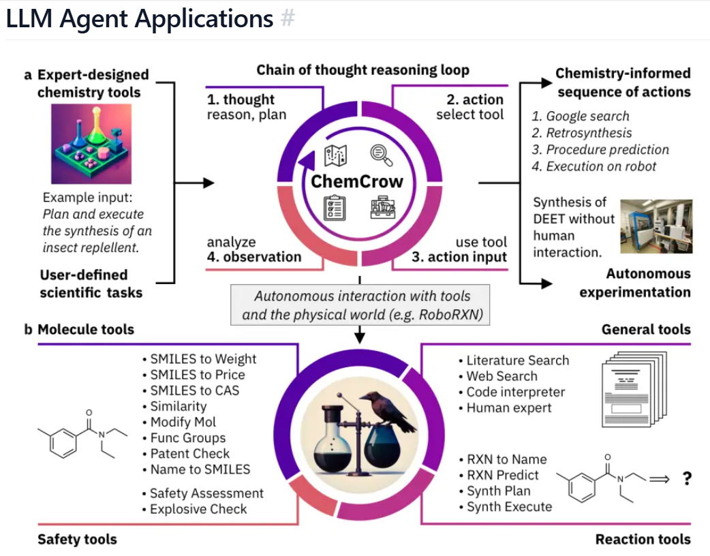

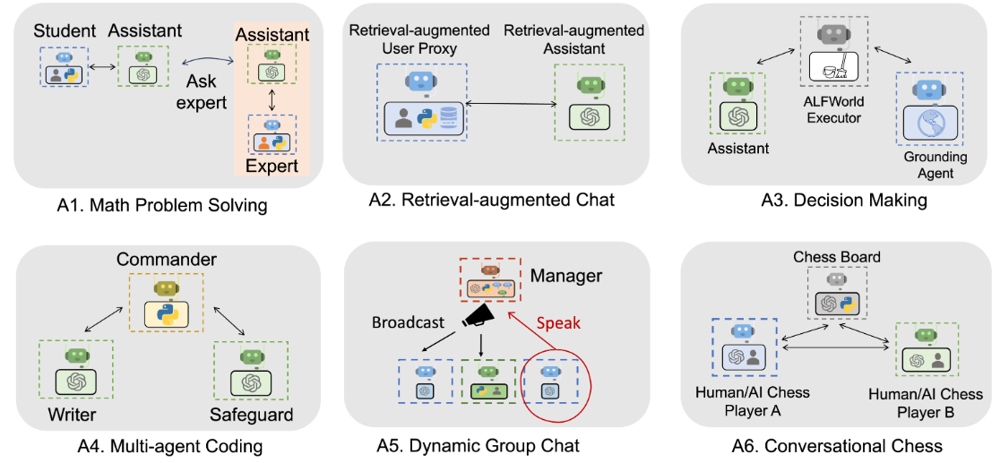
---
### Notlar

-  LLM ajanı sistemleri çoğu kullanım durumu için overengineering/overkill'dir ve yanlış bir seçimdir onun yerine LLM kullanan yazılım ajanları çok daha kolayca aynı ihtiyacı giderebilir.

-  LLM ajanı çerçevelerinde tanımlı araçların doğruluğu yalnızca çok temel düzeydeki işlemler için yeterlidir.

- Çok ajanlı LLM ajanı sistemleri yapıları gereği LLM'lere çok istek atmaktadır bundan dolayı pahalı ve yavaş (ratelimit veya latency kaynaklı) olmaktadır.

-  LLM'Ler  de henüz multi-agent sistemlerde kullanmak için pahalı, az girdi uzunluğu alabilen ve yavaş sistemlerdir ancak bu durum yakın gelecekte değişecektir.

- LLM ajanı çerçeveleri de yine yakın gelecekte gelişecektir.

- LLM alanında başarı, en sofistike sistemi kurmakla ilgili değildir. İhtiyaçlarınız için doğru sistemi kurmakla ilgilidir

### “ Gelecekte dijital dünyayla tüm insan etkileşimi yapay zeka ajanları aracılığıyla gerçekleşecek.”– Yann LeCun 


